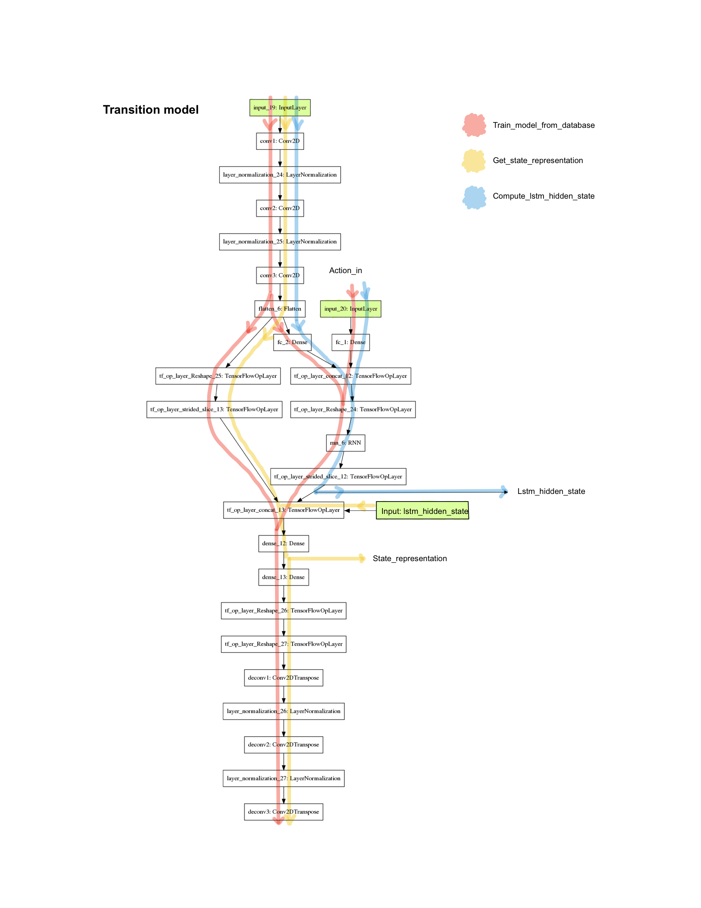

# Interactive-Learning-of-Temporal-Features-for-Control-TF2

In TensorFlow 2 you can create a machine learning model following one of these 3 methods:
1. Keras **Sequential API**: appropriate for a plain stack of layers where each layer has exactly one input tensor and one output tensor.
2. Keras **Functional API**: More flexible than the Sequential API. It can handle shared layers, and multiple inputs or outputs.
3. **Model Subclassing**: The most flexible method. Allows creating your own model class by inheriting from the keras Model class. With this method you can use keras layers or custom layers.

In this code, both the `transition_model` and the `policy_model` have been created with the Keras Functional API available in TensorFlow2. ([Functional API in TensorFlow2 link](https://www.tensorflow.org/guide/keras/functional))

The previous diagram is obtained with the command `tf.keras.utils.plot_model(self.transition_model_training)`

This Functional API makes the creation of a model easier but I also encounter some problems 
1. Variable batch size
2. Different input layer to the model

#### Issue 1: Variable batch size
A first issue is having a different batch size for training and predicting. I took a look to the post *How to use Different Batch Sizes when Training and Predicting with LSTMs* ([Post link](https://machinelearningmastery.com/use-different-batch-sizes-training-predicting-python-keras/)), where it suggests: 

*"A better solution is to use different batch sizes for training and predicting. The way to do this is to copy the weights from the fit network and to create a new network with the pre-trained weights. We can do this easily enough using the `get_weights()` and `set_weights()` functions"*

Following this advice, I create a new instance of the model defined in `neural_network2.py` when it requires a different batch size or sequence length. Then, using `get_weights()`, I get the weights of the main model (`self.transition_model_training`) obtained at the end of the training of each episode, and set those weights  to the other instances of the model.

Main model:
- `get_weights()` from `self.transition_model_training = neural_network.transition_model()`

Other instances of the same model:

- `set_weights()` to `self.model_compute_lstm_hidden_state = neural_network.transition_model()`

- `set_weights()` to `self.model_lstm_hidden_state_batch = neural_network.transition_model()`

#### Issue 2: Different input layer to the model

At the beginning I tried to use a unique model for all the use cases of the code. For example, I tried to create a model where I could use `tf.cond` to choose between `action_in` or the already computed `lstm_hidden_state`; I believe this kind of control flow doesn't work when using a Functional API model because once the model is created, the layers need to be the same and have the same dimensions.

As it can be seen in the diagram, the functions `get_state_representation` and `refresh_image_plots` use the already computed lstm_hidden_state as input whereas `train_model_from_database` and `compute_lstm_hidden_state` use the input `action_in`. For this reason, in the file `neural_network`, I created an additional simplified version of the `transition_model` called `predicting_model`. This `predicting_model` doesn't include the layers `fc_1`, `fc_2` and `rnn_layer` because it doesn't require an `action_in`. The rest of the layers share the same names as in `transition_model` and I can set the weights as explained in the previous point.

---

Finally, all the Functional API models are instantiated just once, otherwise the weights would we reseted every time I create the model object; I have used some if statements in combination with flags to achieve this.